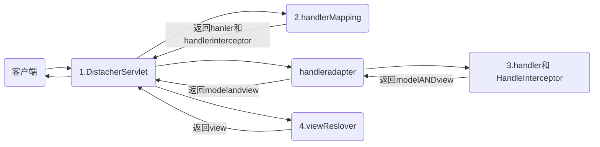

<center>springboot  约定大于配置</center>
[TOC]

# restful风格

- 传统类型：http://localhost:8080/hello/index?name=zhangsan&id=10

- REST：http://localhost:8080/hello/index/zhangsan/10 

    ```java
    @RequestMapping("/rest/{name}/{id}")
    public String rest(@PathVariable("name") String name,@PathVariable("id") int id){
    }
    ```

    

# spring mvc

## mvc

- model 数据层
- view
- controller

## 调用过程




## web.xml配置

- 创建dispatchersevlet

    ```xml
    
      <servlet>
        <servlet-name>dispatcherServlet</servlet-name>
        <servlet-class>org.springframework.web.servlet.DispatcherServlet</servlet-class>
        <init-param>
          <param-name>contextConfigLocation</param-name>
          <param-value>classpath:springmvc.xml</param-value>
        </init-param>
      </servlet>
      
      <servlet-mapping>
        <servlet-name>dispatcherServlet</servlet-name>
        <url-pattern>/</url-pattern>
      </servlet-mapping>
      
    ```

- 自动扫描包下的注解

```xml
 <context:component-scan base-package="com.southwind"></context:component-scan>

```

- 创建 视图解析器 当返回时自动添加前缀后缀

```xml
   <bean class="org.springframework.web.servlet.view.InternalResourceViewResolver">
        <property name="prefix" value="/"></property>
        <property name="suffix" value=".jsp"></property>
    </bean>
```

## 常见注解

#### @Requestmapping

- 参数 params：指定请求中必须包含某些参数，否则无法调用该方法。

    ```java
    @RequestMapping(value = "/index",method = RequestMethod.GET,params = {"name","id=10"})
    
    ```

#####  转发与重定向

```java
@RequestMapping("/forward")
public String forward(){
    return "forward:/index.jsp";
    //        return "index";
}
@RequestMapping("/redirect")
public String redirect(){
    return "redirect:/index.jsp";
}

```


#### @RequestParam:

- 当controller 方法参数与http请求参数不一致  用来映射   

```java
public String index(@RequestParam("name") String str,@RequestParam("id") int age)
```


#### @CookieValue

- 获取cookie某一属性的值

######              


## 绑定参数

#### javabean自动绑定参数

- 当控制器的参数是一个类时且form表单的value为类中属性名字一模一样 会自动倒入类中

    ```java
    public class User {
        private long id;
        private String name;
        private Address address;
    }
    public class Address {
        private String value;
    }
    <form action="/hello/save" method="post">
            用户id：<input type="text" name="id"/><br/>
            用户名：<input type="text" name="name"/><br/>
            用户地址：<input type="text" name="address.value"/><br/>
            <input type="submit" value="注册"/>
        </form>
     @RequestMapping(value = "/save",method = RequestMethod.POST)
    public String save(User user){
        System.out.println(user);
        return "index";
    }
    ```

    

## 中文乱码

#### javabean绑定时控制器输出中文乱码

```xml
<filter>
    <filter-name>encodingFilter</filter-name>
    <filter-class>org.springframework.web.filter.CharacterEncodingFilter</filter-class>
    <init-param>
        <param-name>encoding</param-name>
        <param-value>UTF-8</param-value>
    </init-param>
</filter>

<filter-mapping>
    <filter-name>encodingFilter</filter-name>
    <url-pattern>/*</url-pattern>
</filter-mapping>
```


# spring boot

## 小点

#### spring.boot.view 

- 只有jsp文件才用

####  yml与properties

- 在同一个目录下如果properties里面配置了就不会去yml里面去取值，如果没有配置就会去yml里面去取
- 两种配置方法是互补的

#### 松散绑定

- 如果你在类的属性中用驼峰命名法，那么你可以在配置文件中使用aB->a-b  当使用ConfigurationProperties时ioc会自动注入 

#### webjar

- 把cas jqury 打包到maven

## 默认值

#### 配置文件优先级

1. 项目路径下的config

    > 项目根路径 也可以是 项目打包好的jar包所在目录

2. 项目路径下

3. 类路径config下

4. 类路径下

#### 启动时默认扫描Configurration路径

- ​	当前启动类所在的包或者这个包的子包

#### 静态文件可设置的地方及其优先级及其自定义静态资源位置

- (3)在src/main/resources/目录下创建 

    ​    static文件夹 

    (2)在src/main/resources/目录下创建 

    ​    resources文件夹 

    (4)在src/main/resources/目录下创建 

    ​    public文件夹 

    (1)在src/main/resources/目录下创建 

    ​    META-INF/resources文件夹

- 在启动类那个路径下创建如下此类

    ```java
    @Configuration//配置类
    public class WebMvcConfig implements WebMvcConfigurer{
    
    	
    	@Override
    	public void addResourceHandlers(ResourceHandlerRegistry registry)
    	{
    		//参数1：访问路径的匹配规则
    		registry.addResourceHandler("/test1/**","/test2/**","/test3/**")
    		//参数2：当路径匹配成功之后指定去哪个目录下取相应的文件
    		.addResourceLocations("classpath:/test/","classpath:/static/");
    	}
    }
    ```

    

## Initializr

#### lommock 

- entity 实体类自动生成getter和setter
- @Data 自动创建 getter 和 setter
- @AllArgsConstructor   必须还要有无参构造器
- @NoArgsConstructor 

#### Thymeleaf

- 类似jsp的模版语言

 

#### spring boot devTools

- 热部署工具
    - 当你中途在代码里添加了东西 直接刷新网页就可以


#### Spring Configuration Processor

- 在配置文件中当你输入你定义好的前缀 会自动提示剩下都有哪些属性


## pom文件解释  

```xml
<build>
        <plugins>
            <plugin>
                <groupId>org.springframework.boot</groupId>
                <artifactId>spring-boot-maven-plugin</artifactId>
            </plugin>
        </plugins>
</build>
```

- 没有这个 依赖不会被打包项目jar 包含

## aop

-   sprng-boot-starter-aop

- ```java
    @Aspect
    @Component
    //@EnableAspectJAutoProxy  可以不写默认开启的
    public class MyAspect {
    	
    	
    	/**
    	 * 声明一个切入点
    	 */
    	@Pointcut(value="execution(* com.sxt.domain.Man.eat())")
    	public void pc() {
    		
    	}
    	
    	
    	//@Before(value="pc()")
    	public void brforePc() {
    		before();
    	}
    	
    	
    	//@After(value="pc()")
    	public void afterPc() {
            	after();
    	}
    	
    	
    	@Around(value="pc()")
    	public void around(ProceedingJoinPoint point) throws Throwable {
    		before();
    		point.proceed();//执行目标方法
    		after();
    	}
    	
    	
    	public void before() {
    		System.out.println("饭前搞一杯");
    	}
    	
    	public void after() {
    		System.out.println("饭后搞一根");
    	}
    	
    ```

## thymeleaf

#### 引入

- <html xmlns:th="http://www.thymeleaf.org">

    

#### Thymeleaf模板位置修改

- 默认放在template文件下
- 配置文件 spring.thymeleaf.prefix=classpath....

#### 循环

- th:each="s:${students}"

#### 在js中取值

- var id=[[${student.id}]]

#### Thymeleaf占位符配置

- 配置文件 a=sjkj{0}dfjh{1}

- <div th:text="#{a('dfd','fdfd')}"

#### 语法

```xml
1，简单表达式   
　　1、变量的表达式：${...}     可以从session request context里面取值
　　2、选择变量表达式：*{...}
　　3、信息表达式：#{...}    可以读取IOC容器里面的变量，配置文件
   4、链接URL表达式：@{...}   
<a href="user/query.action">       用于不可直接访问的资源的跳转
3，文本处理
　　1、字符串并置：+
　　2、文字替换：|The name is ${name}|
4，表达式基本对象
　　1、#ctx：上下文对象
　　2、#vars：上下文变量
　　3、#locale：上下文语言环境
　　4、#httpServletRequest：（只有在Web上下文）HttpServletRequest对象   
　　5、#httpSession:（只有在Web上下文）HttpSession对象。              
用法：<span th:text="${#locale.country}">US</span>.
5，实用工具对象　
#dates： java.util的实用方法。对象:日期格式、组件提取等.
#calendars：类似于#日期,但对于java.util。日历对象
#numbers：格式化数字对象的实用方法。
#strings：字符串对象的实用方法:包含startsWith,将/附加等。
#objects：实用方法的对象。
#bools：布尔评价的实用方法。
#arrays：数组的实用方法。
#lists：list集合。
#sets：set集合。
#maps：map集合。
#aggregates：实用程序方法用于创建聚集在数组或集合.
#messages：实用程序方法获取外部信息内部变量表达式,以同样的方式,因为它们将获得使用# {…}语法
#ids：实用程序方法来处理可能重复的id属性(例如,由于迭代)。
```

#### Thymeleaf  获取配置文件 配置文件是resource下的

- ```java
    @Configuration
    public class I18NConfig {
    	@Bean
    	public ResourceBundleMessageSource messageSource() {
            ResourceBundleMessageSource messageSource = new ResourceBundleMessageSource();
            messageSource.setUseCodeAsDefaultMessage(true);
            messageSource.setFallbackToSystemLocale(false);
            messageSource.setBasename("student");//把classpath下面的文件里面的内容做为thymeleaf的信息源
            messageSource.setDefaultEncoding("UTF-8");
            messageSource.setCacheSeconds(2);
            return messageSource;
        }
    }
    ```


## 一些对比

#### 接收时间数据双向

- mvc.date-format  当前端提交字符串日期进行格式转化

- jackson.date-format 当后端转化json串到前端时对日期进行格式化

    

## 基本注解

#### @Configuration

- 相当于一个xml文件
- 等价创建了一个xml文件

#### @Bean

- xml 里一个bean
- 标注在方法上(返回某个实例的方法)
- 类上要添加 **@Configuration**
- 当Bean标签修饰的方法有形式参数时，那么形式参数的值会默认加上@Autowired  也就是会从IOC容器里面去取值

#### @Import

- 由于有默认扫描配置类路径当你想引入其他路径文件时 采用此注解
- 相当于  spring mvc 中的<import> 

#### @ComponentScan

-  该注解默认会扫描该类所在的包下所有的配置类 

- 相当于<context:component-scan base-package=""></context:component-scan>

#### @Qualifier

- ioc 自动注入时 由于有两个类 ioc会不知道注入哪个类
- **@bean**  要加入id  

#### @Component

-  引用配置文件(yml,properties)注入到实体类各个属性值中
-  把普通pojo实例化到spring容器中 

#### @ConfigurationProperties

- 定义配置文件前缀开头
- ioc容器主动注入给我

#### @Value

- 主动去配置文件把值复制给类的属性
- 主动去配置文件把值复制给类的属性
- **不能**  用于类似数组集合这种
- **不能** 松散绑定

#### @PropertySource

- 由于存在优先级等问题  你要想指定这个类去读取某个配置文件 就要使用这个注解

#### @ImportResource

- 使用xml 

#### @Conditional派生注解

- 作用：必须是@Conditional指定的条件成立，才给容器中添加组件，配置类里面的所有内容才生效

    ```txt
    @ConditionalOnJava	系统的java版本是否符合要求
    @ConditionalOnBean	容器中存在指定Bean；
    @ConditionalOnMissingBean	容器中不存在指定Bean；
    @ConditionalOnExpression	满足SpEL表达式指定
    @ConditionalOnClass	系统中有指定的类
    @ConditionalOnMissingClass	系统中没有指定的类
    @ConditionalOnSingleCandidate	容器中只有一个指定的Bean，或者这个Bean是首选Bean
    @ConditionalOnProperty	系统中指定的属性是否有指定的值
    @ConditionalOnResource	类路径下是否存在指定资源文件
    @ConditionalOnWebApplication	当前是web环境
    @ConditionalOnNotWebApplication	当前不是web环境
    @ConditionalOnJndi	JNDI存在指定项
    ```

    

- 主动去配置文件把值复制给类的属性
- 在每个属性上方家＠Value("${student.id}")
- 


 


