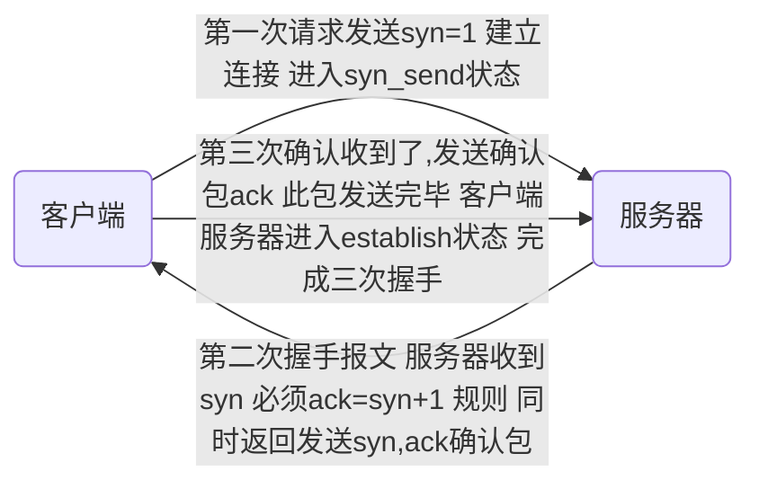

[TOC]


## 协议

#### osi七层协议--概念模型

- 物理层-比特流传输
  - 定义了设备标准如网线类型光纤类型
  - 传输比特流
- 数据链路层
  - 把数据比特流封装成帧  纠错
- 网络层-寻址路由选择
  - 将网络地址翻译成物理地址 
  -  决定数据从哪发，发到哪
  - 本层的数据形式是数据包
  - tcp Ip 协议在此层
- 传输层-建立主机端到端的连接机制
  - 解决了主机间数据传输，解决了传输质量
  - 文件太大时进行分割
- 会话层-建立维护管理连接
- 表示层-处理数据格式 数据加密
- 应用层-提供应用程序间访问规范

#### tcp/ip协议族 -实现了osi七层模型

- 应用层

  - 应用层表示层会话层

- 传输层

  

- 网络层

- 链路层

  - 数据链路层物理层


#### tcp三次握手

- IP 是无连接的网络协议 到哪就完了  啥也不管

- tcp中有原始端口 目标端口 适用于两个设备间
- 1代表是 0代表否



##### 为什么需要三次握手-维护序列号

- 每次握手都要发送一个序列号 数据开始的号
- 每次确认的都是收到的序列号是否等于发送的+1
- 通过序列号外加数据长度确认数据完整度
- 发送序列号 -收到序列号、发送序列号-收到序列号

##### tcp首次握手攻击漏洞

- 当首次请求发送 后 服务端会发送第二次握手 
- 如果收不到 服务端 会 12481632 秒 再次发送 发送大概5次 ，黑客会短时间发送大量请求让队列变满 让正常的服务无法进行，
- 客户端会向通过tcp_syncookies参数回发syncookie 如果返回了syn cookie  直接建立连接

##### tcp四次握手-用于关闭

- 服务端先发送我收到了关闭
- 然后等到所有东西处理完后，再发送一个我已完成结束

##### udp

- 尽最大努力交付 不保证可靠性

- 吞吐量只受限于生成速率

- 无连接网络协议   

    ​                                                                                                                                                                                                                                                                                                                                                                                                                                                                                                                                                                                                                                                                                                                                                         

##### tcp滑动窗口-流量控制与乱序重排

- 在保证能允许接受的范围内，只要有处理完的就继续处理

- 就是一大块缓存

- RTT 发送一个数据包到收到对应ack所花费的时间
- RTO 重传时间间隔 
- 不能总等一段数据发完后 才发送下一段 效率太低 
- 已发送已确认 -已发送未确认-未发送准备好-未发送未准备好

#### http-输入url后按下回车之后经历的流程

- dns解析
- tcp连接
- 发送http请求
- 服务器处理请求并返回http报文
- 浏览器解析渲染页面
- 连接结束

#### get请求与post请求区别

- get将请求信息放在url中，post放在报文体中
- get可以被缓存，post不行

#### cookie和session的区别

- cookie以文本存放在客户端 sesson保存在服务端   

#### http与https区别

- https加密，https需要到ca申请证书

- https默认443端口 http80

- ```mermaid
    graph LR
    a(浏览器)--发送支持的加密算法信息-->b(服务器)
    b--选择一套加密算法以证书的形式  浏览器-->a
    c(浏览器)--检验证书合法性 结合公钥加密信息发送--> d(服务器)
    d--使用私钥解密 验证哈希 加密相应回发-->c
    浏览器解密响应并对消息验真之后进行加密交互数据库
    ```

####  


## Redis

####  redis 特点

- 数据类型丰富
- 支持持久化存储
- 支持主从
- 支持分片

#### 为什么redis能这么快

- 完全基于内存，c语言编写
- 数据结构简单
- 采用单线程

#### 概念

##### 文件描述符

- 一个打开的文件通过唯一的描述符进行引用，该描述符是打开的元数据到文件本身的映射

##### 传统阻塞i/o模型

- 当一个服务堵塞时 剩下的都不能运行

##### 多路io复用模型

- 

##### 数据类型

- hash表

    - hmset lilei name "lilei" age 26 title "senior"
    - hget lilei age   ----> 26

- list列表

    - ```
        lpush mylist aaa
        lpush mylist bbb
        lpush mylist ccc
        ```

    - lrange mylist 0-10 从左到右取前10个

- Set 

    String 元素组成的无序集合 ，通过哈希表，不允许重复，不是先添加先显示

    - ```
        sadd myset 222
        sadd myset 333
        添加元素
        ```

    - ```
        smember myset
        查看集合
        ```

- Sorrted Set

    - 通过分数为集合中的成员进行从小到大的排序

    - ```
        zadd myzset 1 abc
        添加
        zrangebyscore myzset 0 10
        按照分数查询
        ```

#### 从海量key里查询出某一固定前缀的key

- 摸清数据规模，问清楚边界
- keys pattern  命令  
    - 缺点 
        - keys 指令一次性返回所有匹配的key
        - 键的数量过大会使服务卡顿
- scan cursor [match pattern] [COUNT  count]
    - 基于游标的迭代器 ，需要基于上一次的游标延续之前的迭代过程
    - 以0作为游标开始一次新的迭代，知道命令返回游标0完成一次遍历
    - 返回的数量精准规定，支持模糊查询
    - 每次只返回少量

#### 分布式锁

- setnx key value 

    - 缺点 ：会使资源无线占用

- 改进

    - expire key secod  设置key的生存时间  时间到了自动删除

- 终极版

    - set key value [EX seconds] [PX milliseconds] [NX|XX]

    - EX second 设置键的过期时间为second 秒

    - PX millisecond 设置键的过期时间为 millisecond

    - NX 只在键不存在时 ，才对键进行设置操作

    - XX 只在键已经存在时，才对键进行设置操作

    - 操作成功完成时，返回ok,否则返回nil

    - ```
        如果大量key同时过期，同时清除大量的key很耗时，会出现短暂的卡顿现象 解决办法 加个随机值
        ```

#### 使用redis 做异步队列

- blpop key [key...] timeout 阻塞直到队列有消息或超时

```
缺点消费者只能有一个
```

- pub/sub：主题订阅者模式

    - 发送者发送消息，订阅者接收消息

    - 订阅者可以订阅任意的消息

    - ```
        订阅主题    subscribe 主题
        发布消息    publish 主题 内容   
        ```

    - 缺点

        - 消息的发布是无状态的，无法保证可达


## jvm

#### 为什么不直接生成机器码 而是要经过class文件

- 避免每次都要重新检查语法，class文件是已经检查好的 这也就是 idea中的编译

#### 

#### java虚拟机

- classloader 依据特定格式，加载class文件到内存  不负责保证能运行
- native interface 融合不同开发语言到java所用
- Execution engine 对命令进行解析
- runtime data area 内存空间模型

#### 反射

```java
Class rc =Class.forName(包的路径)；
对象 r=(对象)rc.newInstance();
Method method=rc.getDeclaredMethod(方法名，参数如果是string 就  String.class)
如果方法私有 method.setAccessible(true)
Object str=method.invoke(r,参数)
//如果是类的属性
Filed name=rc.getDeclaredFields("name");
//如果私有
name.setAccessible(true)
name.set(r,属性值)
```

getDeclareMethod不能获取继承的方法和他实现的接口方法

getMethod() 可以获取 继承的方法和实现接口的方法 但本类的方法必须是公有的

#### classloader的种类

- BootStrapClassLoader   c++编写  加载核心库 java.*
- ExtClassLoader  java编写，加载扩展库javax.*
- AppClassLoader  java编写，加载程序所在目录

#### 类加载器双亲委派机制

1-类加载器收到类加载的请求；

2-把这个请求委托给父加载器去完成，一直向上委托，直到启动类加载器；

3-启动器加载器检查能不能加载（使用findClass()方法），能就加载（结束）；否则，抛出异常，通知子加载器进行加载。

4-重复步骤三

- 优点防止重复加载 省内存

#### 类的装载过程

- 加载

    ```
    通过classloader加载class文件字节码，生成class对象
    ```

- 链接

    ```
    校验:检查加载的class正确性和安全性
    准备:为类变量分配空间并设置类变量初始化
    解析:将jvm常量池的符号引用转换为直接引用
    ```

- 初始化

    ```
    执行类变量赋值和静态代码块 
    ```

#### LoadClass和forName的区别

- class.forName()除了将类的.class文件加载到JVM中之外，还会对类进行解释，执行类中的static块。
    而classLoader只干一件事情，就是将.class文件加载到JVM中，不会执行static中的内容,只有在newInstance才会去执行static块。
    Class.forName(name, initialize, loader)带参函数也可控制是否加载static块。并且只有调用了newInstance()方法采用调用构造函数，创建类的对象。

#### jvm 三大性能调优参数-Xms -Xms -Xss

- -Xss 每个线程虚拟机栈大小
- -Xms  堆的初始值
- -Xmx堆能达到的最大值

#### java内存模型堆和栈的区别-内存分配策略

- 静态存储 编译时确定每个数据目标在运行时的存储空间需求
- 栈式存储 数据区需求在编译时未知，运行时模块入口前确定
- 堆式存储 编译时或运行时模块入口都无法确定
- 
- 区别
    - 管理方式 栈自动释放 堆需要gc
    - 空间大小 栈比堆小
    - 碎片相关 栈产生的碎片小于堆
    - 分配公式 栈支持静态和动态分配，而堆仅支持动态分配
    - 效率 栈的效率比堆高


#### GC

##### 对象被判定为垃圾的标准

- 没有被其他对象引用

###### 引用计数算法

- 通过判读引用对象来决定对象是否可以被回收

- 堆中每个对象实例都有一个引用计数器，被引用加1 
- 优点 执行效率高，程序执行受影响较小
- 缺点 无法检测出循环引用的情况，导致内存泄露

###### 可达性分析算法

- 通过判断对象引用的引用链是否可达来决定对象是否可以被回收

- GC Roots对象作为起始点，利用数学中图论知识，图中可达对象便是存活对象，而不可达对象则是需要回收的垃圾内存。这里涉及两个概念，一是GC Roots，一是可达性。

    那么可以作为**GC Roots的对象**（见下图）：

    - 虚拟机栈的栈帧的局部变量表所引用的对象；
    - 本地方法栈的JNI所引用的对象；
    - 方法区的静态变量和常量所引用的对象；

##### 垃圾回收算法

##### 标记清除算法

- 从根集合进行扫描，对存活的对象进行标记
- 缺点碎片化  就好比数组 你总是断断旭旭 两个小块，而当你需要三个连续空间时就不行了

##### 复制算法 

- 复制算法将内存划分为两个区间，在任意时间点，所有动态分配的对象都只能分配在其中一个区间（称为活动区间），而另外一个区间（称为空闲区间）则是空闲的。

    ​     当有效内存空间耗尽时，JVM将暂停程序运行，开启复制算法GC线程。接下来GC线程会将活动区间内的存活对象，全部复制到空闲区间，且严格按照内存地址依次排列，与此同时，GC线程将更新存活对象的内存引用地址指向新的内存地址。

- 由于需要搬移存活的对象 不适用于 存活率过高的

##### 分代收集算法

-  　我是一个普通的java对象，我出生在Eden区，在Eden区我还看到和我长的很像的小兄弟，我们在Eden区中玩了挺长时间。有一天Eden区中的人实在是太多了，我就被迫去了Survivor区的“From”区，自从去了Survivor区，我就开始漂了，有时候在Survivor的“From”区，有时候在Survivor的“To”区，居无定所。直到我18岁的时候，爸爸说我成人了，该去社会上闯闯了。于是我就去了年老代那边，年老代里，人很多，并且年龄都挺大的，我在这里也认识了很多人。在年老代里，我生活了20年(每次GC加一岁)，然后被回收。 
-  https://www.cnblogs.com/newAndHui/p/11106232.html 
- Minor GC：新生代GC，指发生在新生代的垃圾收集动作，所有的Minor GC都会触发全世界的暂停（stop-the-world），停止应用程序的线程，不过这个过程非常短暂。
- Major GC/Full GC：老年代GC，指发生在老年代的GC。
    - 触发条件 
        - 老年代空间不足
        - 永久代空间不足
        - minor gc晋升到老年代平均大小大于老年带剩余空间
        - 调用system.gc
- stop-the-world  
    - 由于要执行gc而停止了应用程序的执行
    - 任何一种gc算法都会发生
    - 多数优化通过减少stop the world发生的时间来提高程序的性能

#### 年轻代垃圾收集器

年轻代常见垃圾收集器：

1，Serial收集器 (-XX:+UseSerialGC，采用复制算法)

单线程收集，进行垃圾收集时，必须暂停 所有的工作线程
简单高效，client模式下默认的年轻代收集器

2，ParNew收集器 (-XX:+UseParNewGC，采用复制算法) 

多线程收集，其余的行为，特点和Serial收集器一样
单核执行效率不如Serial，在多核下执行才有优势 
3，Parallel Scavenge收集器 (-XX:UseParallelGC， 采用复制算法)

     吞吐量 = 运行用户代码时间 / (运行用户代码时间 + 垃圾收集时间)

比起关注用户线程的停顿时间，更关注系统的吞吐量
在多核下执行有优势，Server模式下默认的年轻代收集器

#### 老年代垃圾收集器

1，Serial Old收集器 (-XX:+UseSerialOldGC， 采用标记-整理算法)

单线程收集，进行垃圾收集时，必须暂停所有的工作线程
简单高效，Client模式下默认的老年代垃圾收集器


2，Parallel Old收集器 (-XX:+UseParallelOldGC， 采用标记-整理算法)

多线程，吞吐量优先


3，CMS收集器 (-XX:+UseConcMarkSweepGC， 采用标记-清除算法)

初始标记：Stop-the-World 
并发标记：并发追溯标记，程序不会停顿
并发预清理：查找执行并发标记阶段从年轻代晋升到老年代的对象
重新标记：暂停虚拟机，扫描CMS堆中的剩余对象
并发清理：清理垃圾对象，程序不会停顿
并发重置：重置CMS收集器的数据结构


 4，G1收集器 (-XX:UseG1GC， 采用复制+标记+整理算法)

 

 

将整个Java堆内存划分成多个大小相等的Region
年轻代和老年代不再物理隔离
     Garbage First收集器的特点

并行和并发
分代收集
空间整合
可预测的停顿

#### 强引用，软引用，弱引用，虚引用

- 强引用


最普遍的引用：Object obj = new Object();
抛出OutOfMemoryError终止程序也不会回收具有强引用的对象
通过将对象设置为null来弱化引用，使其被回收
软引用 (Soft Reference)

对象处在有用但是非必须的状态
只有当内存空间不足时，GC才会回收该引用的对象内存空间
可以用来实现高速缓存


-  软引用可以和一个引用队列（ReferenceQueue）联合使用，如果软引用所引用的对象被垃圾回收，JAVA虚拟机就会把这个软引用加入到与之关联的引用队列中
    Integer i = new Integer(100);
    SoftReference<Integer> soft = new SoftReference<Integer>(i);
    弱引用 (Weak Reference)

 非必须的对象，比软引用更弱一些
GC时会被回收，不管当前内存空间足够与否
被回收的概率也不大，因为GC线程的优先级比较低
适用于引用偶尔被使用且不影响垃圾收集的对象

- 弱引用可以和一个引用队列（ReferenceQueue）联合使用，如果弱引用所引用的对象被垃圾回收，Java虚拟机就会把这个弱引用加入到与之关联的引用队列中
    Integer i = new Integer(100);
    WeakReference<Integer> soft = new WeakReference<Integer>(i);

- 虚引用 (Phantom Reference) 

不会决定对象的生命周期
任何时候都可能被垃圾收集器回收
跟踪对象被垃圾收集器回收的活动，起哨兵作用
必须和引用队列ReferenceQueue联合使用
Integer i = new Integer(100);
ReferenceQueue queue = new ReferenceQueue();
PhantomReference ref = new PhantomReference(i, queue);

## 数据库

#### 如何设计一个数据库 

- 缓存 sql 日志 权限 容灾 索引 锁

#### 索引

##### 为什么要使用索引

- 存储最小的单位 块 或页
- 避免全表扫描

##### 什么样的信息能成为索引

- 具有一定区分性

##### 索引数据结构

- 二叉搜索树  树太深 io影响速度

- b+ 非叶子节点仅用来存索引，数据都保存在叶子结点中 叶子结点的数据是有序的 支持范围 统计

- hash 查询效率高

    - 不能使用范围查询 哈希函数不能保证顺序运算前后完全一样
    - 不能避免表扫描  也许会出现链表
    - 遇到大量hash值相等的情况下并不一定比B-tree索引高bitMap	

    

    

    

- BitMap

##### 密集索引和稀疏索引区别

- 密集索引文件中每一个搜索码值都对应一个索引值  叶子结点还保存了行的其他列信息
- 稀疏索引文件只为索引码的某些值建立索引项  仅保存键位信息还有主键 地址
- innodb 默认主键为密集索引  若没有主键 该表第一个非空索引作为密集索引  若都不满足 内不会生成一个隐藏主键
    - 查找过程 若是筛选条件为主键 可直接获得数据 若是非主键则需要两次
        - 稀疏主键要执行两次 获得主键索引后 非主键值还要通过主键再次寻找   密集索引只查询一次  

##### 索引调优

###### 如何定位并优化慢查询sql

- 慢日志定位
- 修改索引 

###### 联合索引的最左匹配原则

- 设置a和b为联合索引  当where a= 或where a= and b= 会走联合索引，当where b=时就不会用联合索引 
- 当是等于号时 可以调换顺序 本质是mysql 执行器会自动为你调节顺序 ，而遇到范围时则不行 该在第三个 还是得在第三个
- 解释
    - 当你建立联合索引后 mysql 会根据联合索引第一个键值进行b+ 树，如果 a，b的联合索引  你选用b进行排序   但是b+树 根据a 进行生成后 b已经是乱序，这时mysql 会给b进行全表扫描   
    - 因此当 遇到 范围符号时 sql语句会停止使用索引来查询
    - 

###### 索引是建立的越多越好吗

- 数据变更需要维护索引，因此意味着更多的维护成本
- 更多的索引意味着需要更多的时间


#### 锁

##### 快照读与当前读

- 快照读-读取的是记录数据的可见版本（可能是过期的数据），不用加锁 

    -  不加锁的非阻塞读，select
    -  在串行化隔离级别下  快照读 也退化为当前读
    -  rr隔离级别下，可能会读到历史数据

- 当前读-读取的是记录数据的最新版本，并且当前读返回的记录都会加上锁，保证其他事务不会再并发的修改这条记录 

    - update,delete,insert,select ...lock in share mode,select ...for update

        

##### myisam与innoDB锁方面区别

- myisam 默认用的是表级锁，不支持行级锁
- innodb 默认用的行级锁 不支持表级锁

##### 读锁写锁

- 在同一个表中 读锁加上后还可以继续加读锁
- 写锁加上后不能加读锁
- for update 排他锁 写锁
- lock in share mode共享锁读锁

#### rr级别下避免幻读-gap锁-锁的是当前读

- 比如说 

    ```
    selecet  * from table where id=1
    ```

    运行两次 之所以不会出现幻读 是因为由于 b+树是根据索引够早的，是有序的  所以当你查询条件为非索引时 及时上了锁 你的周边依然能添加 除非你使用的索引作为查询 他就会直接锁住索引 比如有两个主键为10 的数据  左边是6 右边是11  那么就在 6和10  10和10 10和11 之间加上锁

- 主键或唯一索引是否用gap锁

    - 如果全部命中则不使用gap锁 where ID=1and id=4 and  id=5   全部都在表中就叫全部命中
    - 如果部分命中（比如范围查询）或全都没命中则使用gap锁

- 非唯一索引加gap

- 不是索引加gap

#### sql语句书写思路-拼接


## 常见类库


## linux

##### 如何查找特定文件

- find  -name '1.java' 当前目录递归查找
- find  / -name  '1.java ' 从根目录开始查找
- find ~ -name 'a*' 从家目录查找以a开头的  
- find - iname   忽略大小写

#### 检索文件内容

- grep [options] pattern file 查找文件里符合条件的字符串
- grep "mooc"  target* 
- grep  -o  只打印出匹配到的字符 
- grep -v  显示不包括查找字符的所有行 

##### 管道操作符

- 前一个指令的输出作为后一个指定的输入
- 只处理前一个指令正确输出，不处理错误输出 


#### 对文件内容做统计

##### awk

- awk [options] 'cmd' file

- 一次读取一行文本，按输入分隔符进行切片

- 将切片直接保存在内建的变量，$(0) 表示整行    默认分隔符 空格

- ```
    awk '$1==tcp && $2==1 {print $0}' a.txt
    ```

    带有表头

    ```
    awk '（$1==tcp && $2==1）|| NR==1 {print $0}' a.txt
    ```

    ```
    awk -F "," '{print $2}' a.txt    指定分隔符
    ```

    ```
    awk '{array[$1]++}END{for(i in enginearr) print  i "\t" enginear[i]}'
    一样的加一  
    ```

#### 批量替换文本内容

- sed 全名stream editor ,流编辑器 适用于对文本的行内容进行处理

- 用于行操作 默认替换每行第一个  默认改变在终端 源文件不改变

- ```
    sed -i 's/^Str/String/g' a.txt
    、、、、、字符串/打头/目标内容
    -i 源文件改变
    g 该行满足的都替换
    /d 删除满足条件所在的行
    ```


## 多线程与并发

#### 进程与线程的区别

- 进程是资源分配的最小单位，线程是cpu调度的最小单位
- 线程挂了 进程也会挂了
- 进程的切换比线程开销大
- 一个程序产生一个进程，一个进程对应一个jvm实例
- java默认创建一个主线程

#### start和run方法区别

- start（）方法会创建一个新的子线程启动
- run方法只是thread的一个普通方法


