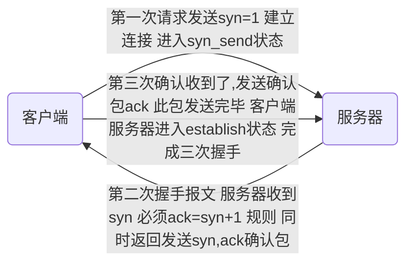

[TOC]


## 协议

#### osi七层协议--概念模型

- 物理层-比特流传输
  - 定义了设备标准如网线类型光纤类型
  - 传输比特流
- 数据链路层
  - 把数据比特流封装成帧  纠错
- 网络层-寻址路由选择
  - 将网络地址翻译成物理地址 
  -  决定数据从哪发，发到哪
  - 本层的数据形式是数据包
  - tcp Ip 协议在此层
- 传输层-建立主机端到端的连接
  - 解决了主机间数据传输，解决了传输质量
  - 文件太大时进行分割
- 会话层-建立维护管理连接
- 表示层-处理数据格式 数据加密
- 应用层-提供应用程序间访问规范

#### tcp/ip协议族 -实现了osi七层模型

- 应用层

  - 应用层表示层会话层

- 传输层

  

- 网络层

- 链路层

  - 数据链路层物理层


#### tcp三次握手

- IP 是无连接的网络协议 到哪就完了  啥也不管

- tcp中有原始端口 目标端口 适用于两个设备间
- 1代表是 0代表否



##### 为什么需要三次握手-维护序列号

- 每次握手都要发送一个序列号 数据开始的号
- 每次确认的都是收到的序列号是否等于发送的+1
- 通过序列号外加数据长度确认数据完整度
- 发送序列号 -收到序列号、发送序列号-收到序列号

##### tcp首次握手攻击漏洞

- 当首次请求发送 后 服务端会发送第二次握手 
- 如果收不到 服务端 会 12481632 秒 再次发送 发送大概5次 ，黑客会短时间发送大量请求让队列变满 让正常的服务无法进行，
- 客户端会向通过tcp_syncookies参数回发syncookie 如果返回了syn cookie  直接建立连接

##### tcp四次握手-用于关闭

- 服务端先发送我收到了关闭
- 然后等到所有东西处理完后，再发送一个我已完成结束

##### udp

- 尽最大努力交付 不保证可靠性

- 吞吐量只受限于生成速率

- 无连接网络协议   

    ​                                                                                                                                                                                                                                                                                                                                                                                                                                                                                                                                                                                                                                                                                                                                                         

##### tcp滑动窗口-流量控制与乱序重排

- 在保证能允许接受的范围内，只要有处理完的就继续处理

- 就是一大块缓存

- RTT 发送一个数据包到收到对应ack所花费的时间
- RTO 重传时间间隔 
- 不能总等一段数据发完后 才发送下一段 效率太低 
- 已发送已确认 -已发送未确认-未发送准备好-未发送未准备好

#### http-输入url后按下回车之后经历的流程

- dns解析
- tcp连接
- 发送http请求
- 服务器处理请求并返回http报文
- 浏览器解析渲染页面
- 连接结束

#### get请求与post请求区别

- get将请求信息放在url中，post放在报文体中
- get可以被缓存，post不行

#### cookie和session的区别

- cookie以文本存放在客户端 sesson保存在服务端   

#### http与https区别

- https加密，https需要到ca申请证书

- https默认443端口 http80

- ```mermaid
    graph LR
    a(浏览器)--发送支持的加密算法信息-->b(服务器)
    b--选择一套加密算法以证书的形式  浏览器-->a
    c(浏览器)--检验证书合法性 结合公钥加密信息发送--> d(服务器)
    d--使用私钥解密 验证哈希 加密相应回发-->c
    浏览器解密响应并对消息验真之后进行加密交互
    ```

    ## 数据库

#### 如何设计一个数据库 

- 缓存 sql 日志 权限 容灾 索引 锁

#### 索引

##### 为什么要使用索引

- 存储最小的单位 块 或页
- 避免全表扫描

##### 什么样的信息能成为索引

- 具有一定区分性

##### 索引数据结构

- 二叉搜索树  树太深 io影响速度

- b+ 非叶子节点仅用来存索引，数据都保存在叶子结点中 叶子结点的数据是有序的 支持范围 统计

- hash 查询效率高

    - 不能使用范围查询 哈希函数不能保证顺序运算前后完全一样
    - 不能避免表扫描  也许会出现链表
    - 遇到大量hash值相等的情况下并不一定比B-tree索引高bitMap	

    

    

    

- BitMap

##### 密集索引和稀疏索引区别

- 密集索引文件中每一个搜索码值都对应一个索引值  叶子结点还保存了行的其他列信息
- 稀疏索引文件只为索引码的某些值建立索引项  仅保存键位信息还有主键 地址
- innodb 默认主键为密集索引  若没有主键 该表第一个非空索引作为密集索引  若都不满足 内不会生成一个隐藏主键
    - 查找过程 若是筛选条件为主键 可直接获得数据 若是非主键则需要两次
        - 稀疏主键要执行两次 获得主键索引后 非主键值还要通过主键再次寻找   密集索引只查询一次  

##### 索引调优

###### 如何定位并优化慢查询sql

- 慢日志定位
- 修改索引 

###### 联合索引的最左匹配原则

- 设置a和b为联合索引  当where a= 或where a= and b= 会走联合索引，当where b=时就不会用联合索引 

###### 索引是建立的越多越好吗