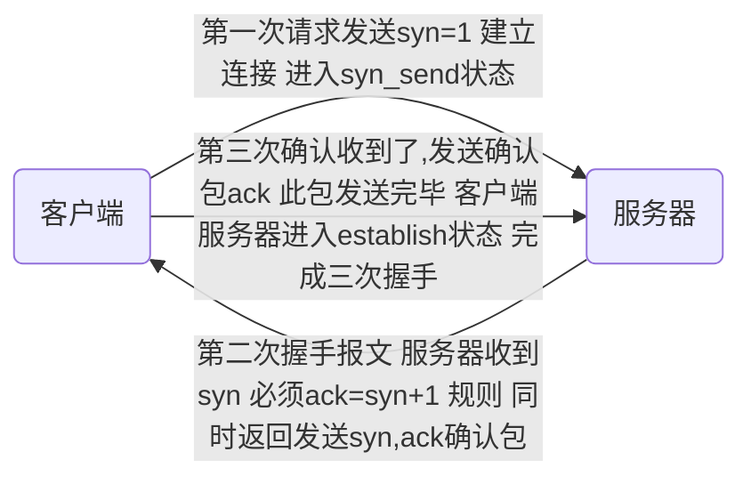

[TOC]


## 协议

#### osi七层协议--概念模型

- 物理层-比特流传输
  - 定义了设备标准如网线类型光纤类型
  - 传输比特流
- 数据链路层
  - 把数据比特流封装成帧  纠错
- 网络层-寻址路由选择
  - 将网络地址翻译成物理地址 
  -  决定数据从哪发，发到哪
  - 本层的数据形式是数据包
  - tcp Ip 协议在此层
- 传输层-建立主机端到端的连接
  - 解决了主机间数据传输，解决了传输质量
  - 文件太大时进行分割
- 会话层-建立维护管理连接
- 表示层-处理数据格式 数据加密
- 应用层-提供应用程序间访问规范

#### tcp/ip协议族 -实现了osi七层模型

- 应用层

  - 应用层表示层会话层

- 传输层

  

- 网络层

- 链路层

  - 数据链路层物理层


#### tcp三次握手

- IP 是无连接的网络协议 到哪就完了  啥也不管

- tcp中有原始端口 目标端口 适用于两个设备间
- 1代表是 0代表否



##### 为什么需要三次握手-维护序列号

- 每次握手都要发送一个序列号 数据开始的号
- 每次确认的都是收到的序列号是否等于发送的+1
- 通过序列号外加数据长度确认数据完整度
- 发送序列号 -收到序列号、发送序列号-收到序列号

##### tcp首次握手攻击漏洞

- 当首次请求发送 后 服务端会发送第二次握手 
- 如果收不到 服务端 会 12481632 秒 再次发送 发送大概5次 ，黑客会短时间发送大量请求让队列变满 让正常的服务无法进行，
- 客户端会向通过tcp_syncookies参数回发syncookie 如果返回了syn cookie  直接建立连接

##### tcp四次握手-用于关闭

- 服务端先发送我收到了关闭
- 然后等到所有东西处理完后，再发送一个我已完成结束

##### udp

- 尽最大努力交付 不保证可靠性

- 吞吐量只受限于生成速率

- 无连接网络协议   

    ​                                                                                                                                                                                                                                                                                                                                                                                                                                                                                                                                                                                                                                                                                                                                                         

##### tcp滑动窗口-流量控制与乱序重排

- 在保证能允许接受的范围内，只要有处理完的就继续处理

- 就是一大块缓存

- RTT 发送一个数据包到收到对应ack所花费的时间
- RTO 重传时间间隔 
- 不能总等一段数据发完后 才发送下一段 效率太低 
- 已发送已确认 -已发送未确认-未发送准备好-未发送未准备好

#### http-输入url后按下回车之后经历的流程

- dns解析
- tcp连接
- 发送http请求
- 服务器处理请求并返回http报文
- 浏览器解析渲染页面
- 连接结束

#### get请求与post请求区别

- get将请求信息放在url中，post放在报文体中
- get可以被缓存，post不行

#### cookie和session的区别

- cookie以文本存放在客户端 sesson保存在服务端   

#### http与https区别

- https加密，https需要到ca申请证书

- https默认443端口 http80

- ```mermaid
    graph LR
    a(浏览器)--发送支持的加密算法信息-->b(服务器)
    b--选择一套加密算法以证书的形式  浏览器-->a
    c(浏览器)--检验证书合法性 结合公钥加密信息发送--> d(服务器)
    d--使用私钥解密 验证哈希 加密相应回发-->c
    浏览器解密响应并对消息验真之后进行加密交互数据库
    ```

####  


## Redis

####  redis 特点

- 数据类型丰富
- 支持持久化存储
- 支持主从
- 支持分片

#### 为什么redis能这么快

- 完全基于内存，c语言编写
- 数据结构简单
- 采用单线程

#### 概念

##### 文件描述符

- 一个打开的文件通过唯一的描述符进行引用，该描述符是打开的元数据到文件本身的映射

##### 传统阻塞i/o模型

- 当一个服务堵塞时 剩下的都不能运行

##### 多路io复用模型

- 

##### 数据类型

- hash表

    - hmset lilei name "lilei" age 26 title "senior"
    - hget lilei age   ----> 26

- list列表

    - ```
        lpush mylist aaa
        lpush mylist bbb
        lpush mylist ccc
        ```

    - lrange mylist 0-10 从左到右取前10个

- Set 

    String 元素组成的无序集合 ，通过哈希表，不允许重复，不是先添加先显示

    - ```
        sadd myset 222
        sadd myset 333
        添加元素
        ```

    - ```
        smember myset
        查看集合
        ```

- Sorrted Set

    - 通过分数为集合中的成员进行从小到大的排序

    - ```
        zadd myzset 1 abc
        添加
        zrangebyscore myzset 0 10
        按照分数查询
        ```

        

## 数据库

#### 如何设计一个数据库 

- 缓存 sql 日志 权限 容灾 索引 锁

#### 索引

##### 为什么要使用索引

- 存储最小的单位 块 或页
- 避免全表扫描

##### 什么样的信息能成为索引

- 具有一定区分性

##### 索引数据结构

- 二叉搜索树  树太深 io影响速度

- b+ 非叶子节点仅用来存索引，数据都保存在叶子结点中 叶子结点的数据是有序的 支持范围 统计

- hash 查询效率高

    - 不能使用范围查询 哈希函数不能保证顺序运算前后完全一样
    - 不能避免表扫描  也许会出现链表
    - 遇到大量hash值相等的情况下并不一定比B-tree索引高bitMap	

    

    

    

- BitMap

##### 密集索引和稀疏索引区别

- 密集索引文件中每一个搜索码值都对应一个索引值  叶子结点还保存了行的其他列信息
- 稀疏索引文件只为索引码的某些值建立索引项  仅保存键位信息还有主键 地址
- innodb 默认主键为密集索引  若没有主键 该表第一个非空索引作为密集索引  若都不满足 内不会生成一个隐藏主键
    - 查找过程 若是筛选条件为主键 可直接获得数据 若是非主键则需要两次
        - 稀疏主键要执行两次 获得主键索引后 非主键值还要通过主键再次寻找   密集索引只查询一次  

##### 索引调优

###### 如何定位并优化慢查询sql

- 慢日志定位
- 修改索引 

###### 联合索引的最左匹配原则

- 设置a和b为联合索引  当where a= 或where a= and b= 会走联合索引，当where b=时就不会用联合索引 
- 当是等于号时 可以调换顺序 本质是mysql 执行器会自动为你调节顺序 ，而遇到范围时则不行 该在第三个 还是得在第三个
- 解释
    - 当你建立联合索引后 mysql 会根据联合索引第一个键值进行b+ 树，如果 a，b的联合索引  你选用b进行排序   但是b+树 根据a 进行生成后 b已经是乱序，这时mysql 会给b进行全表扫描   
    - 因此当 遇到 范围符号时 sql语句会停止使用索引来查询
    - 

###### 索引是建立的越多越好吗

- 数据变更需要维护索引，因此意味着更多的维护成本
- 更多的索引意味着需要更多的时间


#### 锁

##### 快照读与当前读

-  读取的是记录数据的可见版本（可能是过期的数据），不用加锁 
-  读取的是记录数据的最新版本，并且当前读返回的记录都会加上锁，保证其他事务不会再并发的修改这条记录 

##### myisam与innoDB锁方面区别

- myisam 默认用的是表级锁，不支持行级锁
- innodb 默认用的行级锁 不支持表级锁

##### 读锁写锁

- 在同一个表中 读锁加上后还可以继续加读锁
- 写锁加上后不能加读锁
- for update 排他锁 写锁
- lock in share mode共享锁读锁


## 常见类库


## linux

##### 如何查找特定文件

- find  -name '1.java' 当前目录递归查找
- find  / -name  '1.java ' 从根目录开始查找
- find ~ -name 'a*' 从家目录查找以a开头的  
- find - iname   忽略大小写

#### 检索文件内容

- grep [options] pattern file 查找文件里符合条件的字符串
- grep "mooc"  target* 
- grep  -o  只打印出匹配到的字符 
- grep -v  显示不包括查找字符的所有行 

##### 管道操作符

- 前一个指令的输出作为后一个指定的输入
- 只处理前一个指令正确输出，不处理错误输出 


#### 对文件内容做统计

##### awk

- awk [options] 'cmd' file

- 一次读取一行文本，按输入分隔符进行切片

- 将切片直接保存在内建的变量，$(0) 表示整行    默认分隔符 空格

- ```
    awk '$1==tcp && $2==1 {print $0}' a.txt
    ```

    带有表头

    ```
    awk '（$1==tcp && $2==1）|| NR==1 {print $0}' a.txt
    ```

    ```
    awk -F "," '{print $2}' a.txt    指定分隔符
    ```

    ```
    awk '{array[$1]++}END{for(i in enginearr) print  i "\t" enginear[i]}'
    一样的加一  
    ```

#### 批量替换文本内容

- sed 全名stream editor ,流编辑器 适用于对文本的行内容进行处理

- 用于行操作 默认替换每行第一个  默认改变在终端 源文件不改变

- ```
    sed -i 's/^Str/String/g' a.txt
    、、、、、字符串/打头/目标内容
    -i 源文件改变
    g 该行满足的都替换
    /d 删除满足条件所在的行
    ```

    

